# RECLETTER

---

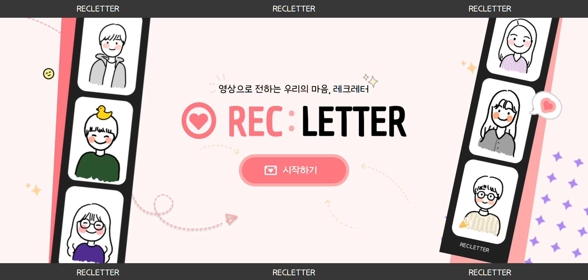

# 목차

---

1. [개요](#1-개요)
2. [개발 환경](#2-개발-환경)
3. [서비스 화면](#3-서비스-화면)
4. [주요 기능](#4-주요-기능)
5. [기술 소개](#5-기술-소개)
6. [설계 문서](#6-설계-문서)
7. [팀원 소개](#7-팀원-소개)

# 1. 개요

---

## 프로젝트 소개

### REC: LETTER

-   영상으로 전하는 우리의 마음, 레크레터
-   REC: LETTER는 RECord + LETTER의 합성어로 우리의 감동과 담아 영상 편지를 제작하는 특별한 플랫폼입니다.

### 목적

-   저희 서비스는 혼자 혹은 함께 영상을 촬영하고 꾸며 영상 편지로 만들어 소중한 대상에게 선물합니다.
-   기념일이나 추억을 남기고 싶을 때 쉽게 영상편지를 만드는 목적으로 만들어졌습니다.

### 타겟

-   특별한 날을 기념하고 싶은 10~30대
-   멀리 떨어진 사람에게 축하 메시지를 보내고 싶은 사람들
-   영상 편지는 찍고 싶으나 편집이 힘든 사람들
-   특히, SSAFY 소속 혹은 졸업생

### 서비스 개요

- REC: LETTER는 영상 편지 제작 서비스로, 참가자들이 함께 영상을 촬영하고 자유롭게 꾸밀 수 있는 공간을 제공합니다. 사용자는 손쉽게 영상을 편집하고 완성된 작품을 공유할 수 있습니다.

### 타 서비스와의 차별성

-   영상 제작 플랫폼_ : 다른 플랫폼들은 외주 위주로 돌아가는 경우가 많습니다. 하지만 REC: LETTER는 지인들끼리의 특별한 순간을 직접 참여하여 손쉽게 만들 수 있습니다.
-   영상 제작 프로그램_ : REC: LETTER는 어려운 기술과 능력 없이 누구라도 특별한 순간의 감동과 기억을 준다는 점에 초점을 두고있습니다. 손쉽게 영상을 촬영하고 취합, 편집하여 공유할 수 있다는 점에서 간편함을 추구합니다. 

# 2. 개발 환경

---

### Management Tool

### IDE

### Infra

### Frontend

### Backend

# 3. 서비스 화면

---

### 로그인 페이지

-   일반 로그인

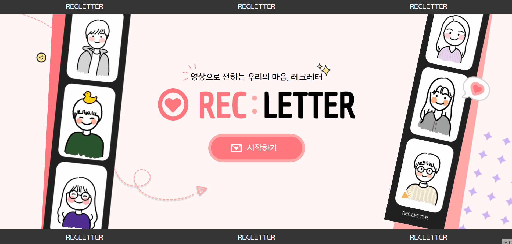

-   구글 소셜 로그인

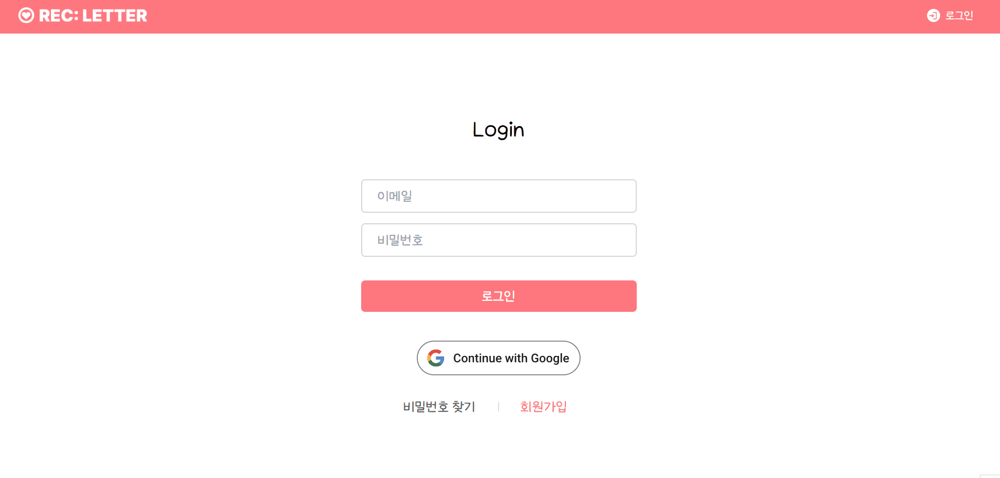

-   기능 설명
    -   일반 로그인이 가능하며, 구글 계정을 이용한 소셜 로그인도 지원합니다.
    -   구글 계정은 별도의 회원 가입 절차 없이 구글 로그인 시 자동으로 회원가입, 로그인이 됩니다.

### 회원가입 페이지

-   회원 가입 페이지

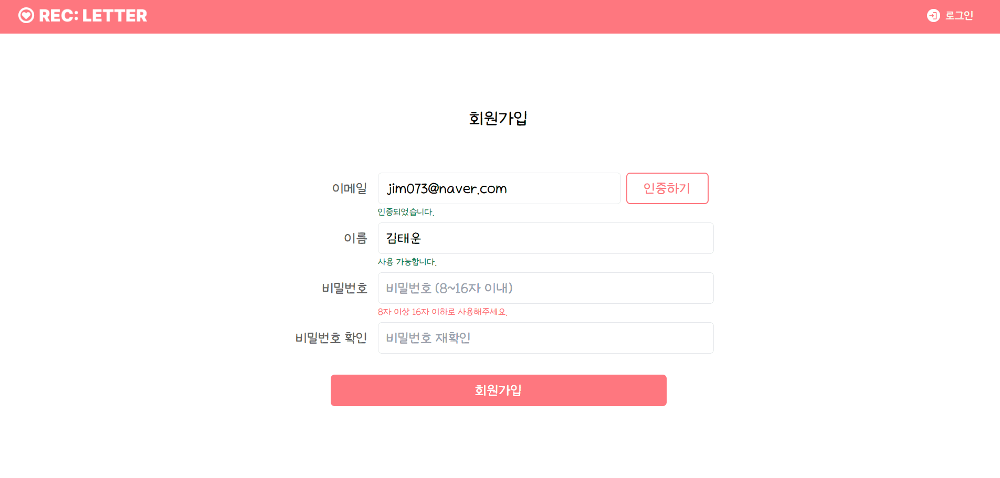

-   기능 설명
    -   일반 로그인에 사용할 계정을 생성하는 페이지입니다.
    -   이메일, 이름, 비밀번호, 비밀번호 확인을 입력합니다.
    -   이메일의 경우, 이메일 인증을 요청한 후, 이메일 인증이 된 경우만 회원가입이 가능합니다. 이미 가입된 계정이 있으면 안됩니다.
        -   이메일 인증은 이메일을 전송한 후, 인증코드를 입력하는 방식으로, 인증 코드는 전송 후 10분간 유효합니다.
    -   이름은 2자 이상, 16자 이하로 제한되어 있습니다.
    -   비밀번호는 8자 이상 16자 이하로 가능하고, 비밀번호 확인란에 동일한 값을 입력해야 가입 가능합니다.

### 비밀번호 찾기

-   비밀번호 찾기 화면

-   이메일, 비밀번호, 비밀번호 확인을 입력합니다.
-   이메일 인증을 받은 후 이용 가능합니다.
    -   이메일 인증 방식은 회원 가입 시와 동일한 인증코드 방식이고, 유효 시간은 10분으로 같습니다.
-   비밀번호를 알려주는 방식이 아닌 이메일 인증을 받은 후 비밀번호를 변경하는 방식입니다. 새 비밀번호와 비밀번호 확인을 입력한 후, 비밀번호 재설정 버튼을 눌러 비밀번호를 새로 입력한 값으로 설정하는 방식입니다.
    -   비밀번호 제한 조건은 가입 시와 동일한 8~16자 입니다.

### 마이페이지

-   이름 변경 화면

-   회원 탈퇴 화면

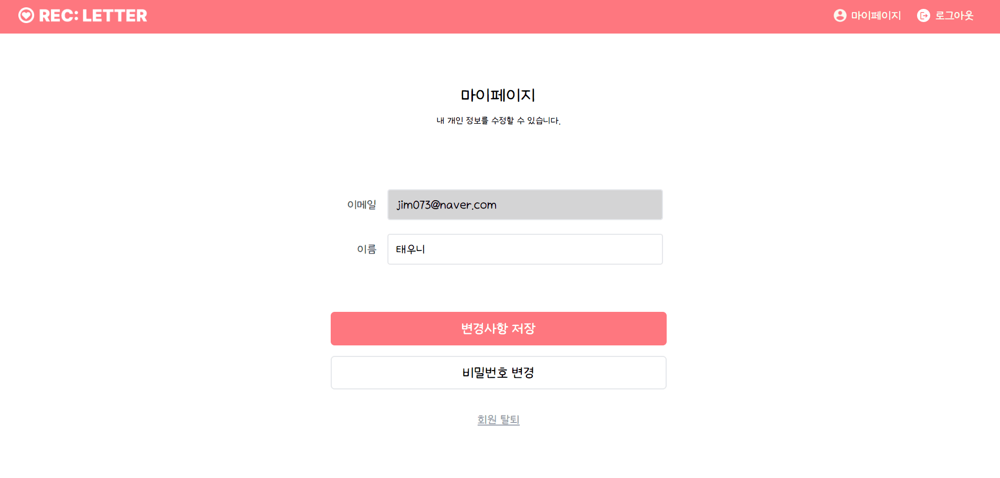

-   기능 설명
    -   내 개인정보 열람 및 수정이 가능합니다. 개인정보로는 이메일, 이름이 있습니다.
    -   이름은 수정 가능합니다. 이메일은 불가능합니다.
    -   비밀번호 변경 버튼을 통해 비밀번호 변경 페이지로 갈 수 있습니다. 구글 소셜 로그인 시 비활성화 됩니다.
    -   회원 탈퇴 버튼을 누르면 회원 탈퇴 진행이 가능합니다. 버튼 클릭 후 나오는 경고창에서 확인을 누르면 회원 탈퇴가 완료됩니다.

### 비밀번호 변경 페이지

-   비밀번호 변경 페이지

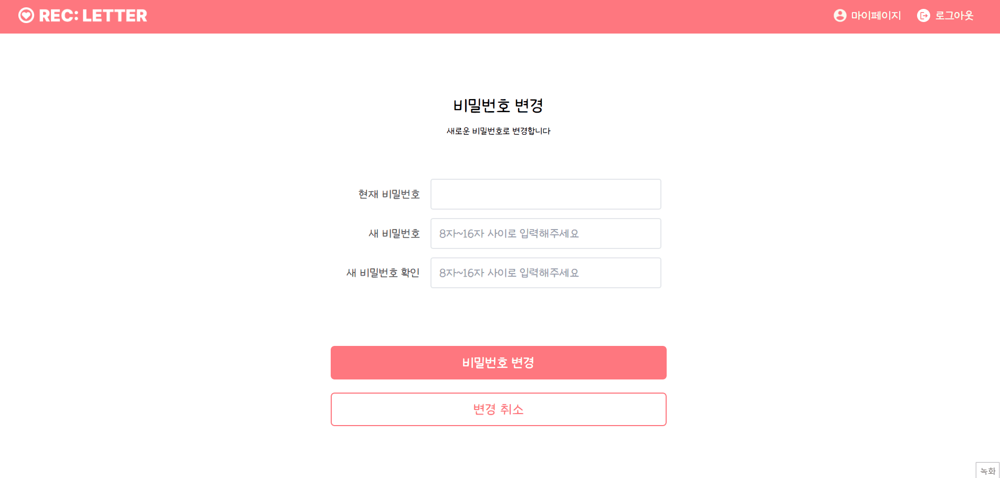

-   현재 비밀번호를 입력하고, 새 비밀번호로 변경 가능합니다.
-   새 비밀번호도 8~16자의 제한 조건이 있고, 새 비밀번호와 새 비밀번호 확인을 입력해야 합니다.

### 메인 페이지

-   탭 전환

-   스튜디오 삭제 화면

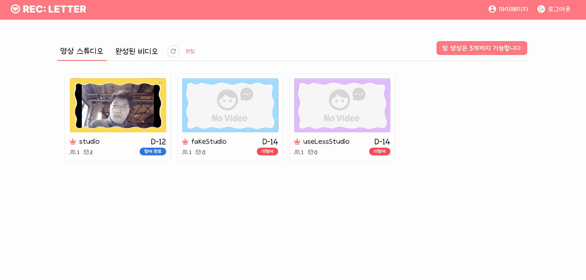

-   기능 설명
    -   로그인을 한 이후 보여지는 첫 화면입니다.
    -   영상 스튜디오, 완성된 비디오 탭으로 이루어집니다.
    -   영상 스튜디오 탭에서는 현재 참가중인 스튜디오의 목록이 나옵니다.
        -   각 스튜디오의 이름, 남은 마감 기한, 참여 여부, 현재 있는 비디오 중 하나의 섬네일, 참여자 수, 영상 개수를 보여줍니다.
            -   참여 여부는 스튜디오 참여자들 중 현재 스튜디오에 올린 영상이 있는지 여부로, 있으면 ‘참여 완료’, 없으면 ‘미참여’ 입니다.
        -   본인이 만든 스튜디오면 왕관 모양이 뜹니다.
        -   마감 기한이 가까운 순으로 나열됩니다.
    -   완성된 비디오 탭에는 완성된 비디오 목록과 남은 유지 기간이 나옵니다.
    -   새로 고침 버튼을 이용하여 스튜디오 정보를 새로 고침할 수 있습니다.
    -   편집 버튼은 영상 스튜디오 탭이 활성화 되었을 때만 보입니다. 스튜디오를 선택해 삭제할 수 있습니다.
    -   새로운 스튜디오 생성 버튼을 이용해 스튜디오 생성 페이지로 이동할 수 있습니다.

### 스튜디오 메인 페이지

-   영상 감상 화면

-   영상 삭제 화면

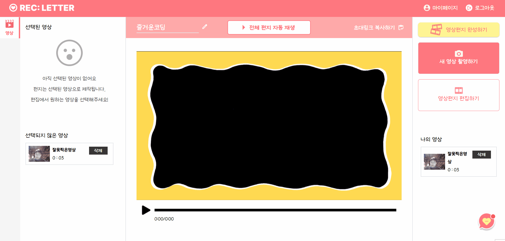

-   스튜디오 이름 변경 화면

-   초대 링크 복사, 편지 완성 화면

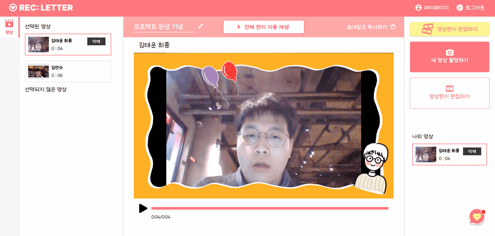

-   기능 설명
    -   스튜디오에 들어가면 제일 먼저 보이는 화면입니다.
    -   링크를 복사해 전달할 경우, 전달 받은 상대방이 로그인 후 해당 링크로 이동하면 자동으로 스튜디오 참여자로 등록됩니다.
        -   초대링크 복사하기 버튼을 통해 현재 주소를 복사 가능합니다.
    -   현재 업로드된 영상을 모두 볼 수 있습니다.
        -   현재 선택된 영상과 선택되지 않은 영상으로 나누어집니다. 선택된 영상은 현재 편집 상태에서 사용되었는지, 사용되지 않았는지로 구분됩니다.
        -   선택된 영상의 경우, 편집 시의 순서대로 영상이 나열됩니다.
        -   나의 영상이 우측 아래에 표시됩니다.
        -   현재 선택된 프레임, 스티커가 적용된 상태로 영상이 재생됩니다.
        -   전체 편지 자동재생을 통해 현재 선택된 영상의 연속 재생이 가능합니다. 전체 편지 자동 재생의 경우, 현재 선택한 BGM이 나옵니다.
            -   전체 편지 자동재생은 중간에 개별 영상을 클릭하면 해제됩니다.
        -   각 영상을 클릭해 개별적으로 재생 가능합니다. BGM은 지원하지 않습니다.
        -   나의 영상은 삭제 가능합니다. 삭제 확인 모달에서 확인을 눌러 삭제 가능합니다.
    -   새 영상 촬영하기 버튼으로 개인 영상 촬영 페이지로 이동합니다.
    -   영상편지 편집하기 버튼으로 영상편지 편집 페이지로 이동합니다.
    -   영상편지 완성하기 버튼을 눌러 영상 완성 요청을 할 수 있습니다.
        -   기본적으로 스튜디오를 생성한 사람만 누를 수 있고, 마감기한이 2일 이하 남은 경우 다른 사용자도 누를 수 있습니다.
        -   현재의 설정대로 영상이 인코딩됩니다.
        -   선택된 영상이 있어야 누를 수 있습니다.
        -   완성하기 요청이 전송된 이후로는 스튜디오에 접근할 수 없습니다.
    -   스튜디오 이름 변경이 가능합니다. 변경은 스튜디오를 생성한 사람만 가능합니다.
    -   우측 아래 채팅 버튼으로 채팅이 가능합니다. 현재 접속한 사용자들끼리 사용 가능하고, 이전의 기록은 소멸됩니다.
        -   채팅은 각 스튜디오별로 개별적으로 작동합니다.

### 개인 영상 촬영 페이지

-   영상 촬영 화면

-   스크립트 기능 화면

-   영상 선택 화면

-   기능 설명
    -   개인 영상 촬영이 가능합니다.
    -   현재 적용된 프레임, 스티커를 볼 수 있습니다.
    -   스크립트를 통해 영상 촬영에 사용할 스크립트를 볼 수 있고, 제공된 템플릿을 이용 가능합니다.
    -   영상 촬영은 최대 1분까지입니다. 영상 촬영 버튼 클릭 시 경고문이 나오고 촬영이 시작됩니다.
        -   경고문은 매 촬영마다 나오는 것이 기본값이며, ‘더 이상 안내문을 보지 않습니다’에 체크하면 추가적으로 나오지 않습니다. 만약 페이지를 나갔다가 다시 들어오면 다시 경고문이 활성화됩니다.
        -   영상 길이가 1분을 넘어가려 하면 자동으로 촬영이 종료됩니다.
        -   영상은 여러 개 촬영 가능합니다. 하지만 단 하나의 영상만 선택 가능합니다.
        -   선택된 영상은 빨간 테두리로 표시되고, ‘다음단계로’ 버튼을 눌러 개인 영상 편집 페이지로 진행 가능합니다. 선택된 영상이 없으면 진행 불가능합니다. 영상 촬영이 종료되면 현재 촬영한 영상이 자동 선택됩니다.
        -   페이지에서 나가면 현재 촬영한 영상은 소실됩니다. ‘다음단계로’버튼을 누를 경우, 현재 선택한 영상을 제외한 정보는 모두 소실됩니다.
    -   좌측 사이드바에서 촬영한 영상 리스트를 볼 수 있고, 재생할 수 있으며, 영상 제목의 변경이 가능합니다. 삭제도 가능합니다.
    -   우측 아래 채팅 버튼으로 채팅이 가능합니다. 현재 접속한 사용자들끼리 사용 가능하고, 이전의 기록은 소멸됩니다.
        -   채팅은 각 스튜디오별로 개별적으로 작동합니다.

### 개인 영상 편집 페이지

-   영상 편집 화면

-   기능 설명
    -   선택한 동영상 미리보기, 이름 변경, 사용 구간 선택이 가능합니다.
        -   이름 변경의 경우 영상 플레이어 위 박스에서 작성 가능합니다.
        -   사용할 구간 선택의 경우 왼쪽 사이드바에서 가능하고, 사용 구간을 조절하면 자동으로 비디오 플레이어는 해당 구간만 재생 가능합니다.
        -   ‘편집 내용 전체 초기화’ 버튼을 통해 사용할 구간을 초기값으로 재설정 가능합니다. 초기값은 영상 전체입니다.
    -   촬영한 영상 정보가 우측에 표시됩니다.
    -   저장하기 버튼을 누르면 영상이 서버에 저장됩니다.
    -   우측 아래 채팅 버튼으로 채팅이 가능합니다. 현재 접속한 사용자들끼리 사용 가능하고, 이전의 기록은 소멸됩니다.
        -   채팅은 각 스튜디오별로 개별적으로 작동합니다.

### 영상 편지 편집하기 페이지

-   화면 공유 화면

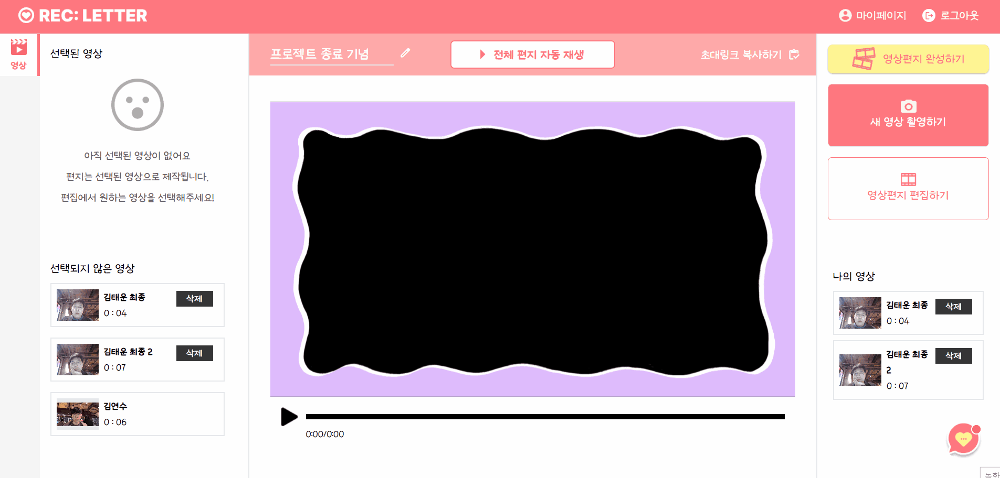

-   영상 선택 화면

-   영상 프레임, 오디오 설정 화면

-   영상 스티커 기능 화면

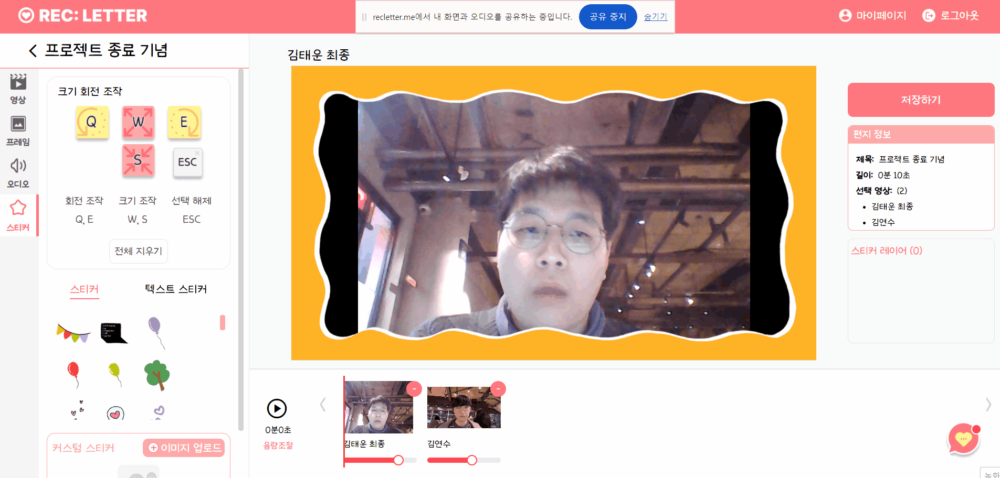

-   기능 설명
    -   영상 편지의 편집이 가능합니다.
    -   편집은 동시에 한 명만 이용 가능합니다.
    -   접속과 동시에 화면 공유가 시작되고, 이후 입장하는 사람들은 영상 편집 감상 페이지로 자동 이동 되고, 해당 페이지에서 영상 편집 화면을 구경하고, 채팅을 통해 피드백 가능합니다.
    -   영상 선택, 순서 변경, 프레임 변경, BGM 변경, 스티커 적용이 가능합니다.
        -   좌측 사이드바에서 무엇을 변경할지 선택 가능합니다.
        -   선택하지 않은 영상 리스트에서 클릭하면 추가한 순서대로 영상이 선택되고, 선택된 영상의 빼기 버튼으로 선택 취소도 가능합니다.
        -   BGM의 볼륨을 조절할 수 있고, 선택된 영상별 볼륨 조절도 가능합니다.
        -   전체 영상 볼륨 조절 버튼을 통해 모든 영상의 볼륨 조절이 가능합니다.
        -   볼륨은 0~200 입니다.
    -   스티커를 선택할 수 있고, 텍스트를 입력해 스티커로 만들 수 있고, 이미지를 업로드해 사용 가능합니다. 키보드를 눌러 돌리기, 크기 조작, 선택 해제가 가능합니다.
    -   스티커 전체 지우기가 가능하고, 스티커 레이어 탭을 통해 개별 삭제도 가능합니다.
    -   가운데 영상 플레이어에서 편집된 영상의 미리 보기가 가능하고, 아래쪽 영상을 클릭해, 선택한 영상부터 재생도 가능합니다.
    -   현재의 영상 편지의 정보를 우측에서 볼 수 있습니다. 선택한 영상에 따라 영상의 길이가 바뀝니다. 완성된 영상의 길이와 현재 선택된 영상의 리스트를 볼 수 있습니다.
    -   저장하기 버튼을 통해 현재의 편집 상태를 저장 가능합니다.
    -   우측 아래 채팅 버튼으로 채팅이 가능합니다. 현재 접속한 사용자들끼리 사용 가능하고, 이전의 기록은 소멸됩니다.
        -   채팅은 각 스튜디오별로 개별적으로 작동합니다.

### 영상 편집 감상 페이지

-   영상 감상 화면

-   기능 설명
    -   현재 편집중인 사용자명과 영상 편집 화면을 감상할 수 있습니다.
    -   채팅을 통해 현재 편집자에게 피드백 가능합니다.
    -   회의 나가기 버튼을 통해 현재 페이지에서 나갈 수 있습니다.

### 영상 편지 완성 페이지

-   완성된 편지 화면

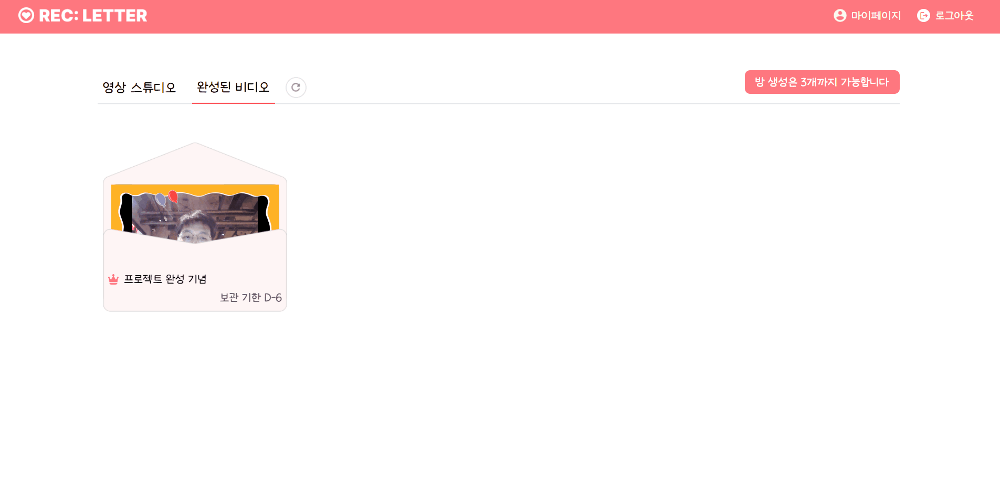

-   완성된 영상 편지를 감상 가능합니다.
-   영상을 다운로드 받거나 공유 가능합니다.
    -   공유는 QR코드와 링크 복사를 통해 가능합니다.
-   아래의 ‘나도 영상편지 만들기’ 버튼을 누르면 메인 페이지로 이동합니다.

### 헤더바

-   로그인 전

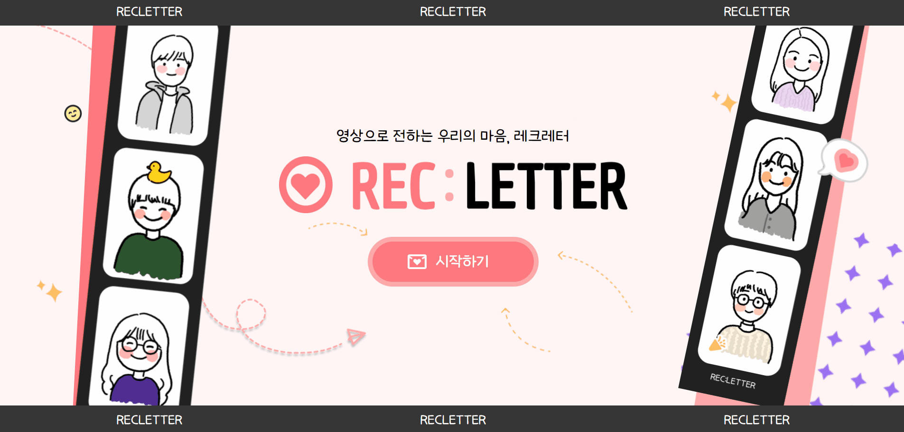

-   로그인 후

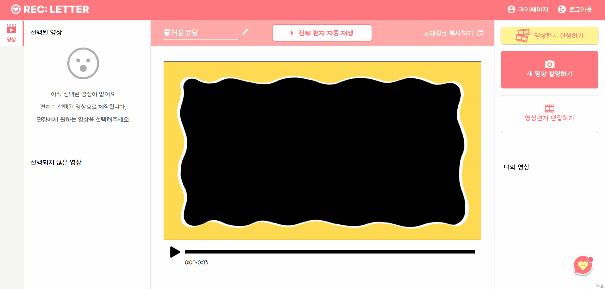

-   기능 설명
    -   로그인, 로그아웃, 마이페이지 이동이 가능합니다.
    -   마이페이지, 로그아웃은 로그인한 상태에서만 가능합니다.

# 4. 주요 기능

---

-   로그인/로그아웃
    -   OAuth2를 이용한 구글 소셜 로그인 지원
-   회원 가입
-   비밀번호 찾기, 이름 변경
-   회원 탈퇴
-   스튜디오 생성
    -   기본 프레임, 마감 기한 설정
-   스튜디오 삭제
-   스튜디오 초대
-   개인 영상 촬영
    -   스크립트 보기
    -   영상 제목 변경
-   개인 영상 편집
    -   앞뒤 자르기
    -   영상 제목 변경
-   전체 영상 편집
    -   사용 영상 선택 및 영상 순서 지정
    -   프레임 변경
    -   BGM 변경
    -   스티커 이용
    -   영상, BGM 볼륨 조절
    -   편집된 영상 미리보기
    -   편집 화면 공유
-   업로드 된 영상 미리 보기
    -   현재 선택된 영상 전체 재생
-   본인 영상 삭제
-   영상 제작 완료
    -   완성된 영상 감상
    -   QR 코드, 링크 공유
    -   다운로드
-   채팅

# 5. 기술 소개

---

-   영상 촬영
    -   `Media Capture and Streams API`를 이용해 영상 촬영 및 영상 녹화 기능 구현
-   영상 편집(프론트엔드)
    -   `ffmpeg.wasm` 라이브러리를 이용하여 영상의 앞 뒤 자르기 구현.
-   영상 편집(백엔드)
    -   `ffmpeg`, `moviepy`를 활용하여 사이즈 조절, 영상 연결, 프레임 이미지 삽입 등 필요한 편집 기능 구현
    -   `Canvas`,`html2canvas`를 활용하여 영상 사이즈에 맞는 이미지 생성 및 배치, 통합 기능 구현
-   화면 공유
    -   `WebRTC` 기술을 이용한 라이브러리의 일종인 `OpenVidu`를 이용해 타인과의 화면 공유 기술 구현
-   CI/CD
    -   `Jenkins`, `Docker`, `Docker Hub`를 활용하여 CI/CD 구현
-   비동기 이벤트 분산 처리
    -   `Kafka` 를 활용하여 영상 인코딩에 관련된 동작들을 비동기적으로 분산 처리하는 기능 구현
-   채팅
    -   `WebSocket` 기술을 활용한 사용자 간 채팅 기능 구현
-   로그인
    -   `OAuth2` 기술을 이용한 구글 소셜 로그인 구현
    -   `JWT` 기술을 활용한 비밀번호 보안 강화

# 6. 설계 문서

---

-   ERD

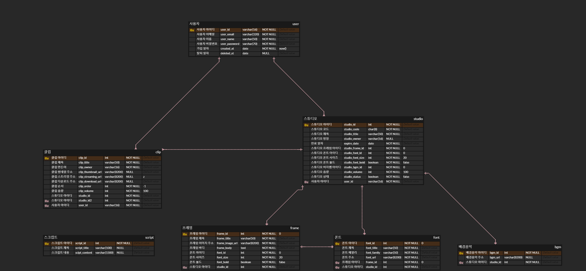

-   API 문서

| 분류 | 요청 방식 | 기능 | url | request | response |
| --- | --- | --- | --- | --- | --- |
| 회원 인증 | GET | 사용자 토큰 검증 | /auth |  |  |
| 회원 인증 | POST | 회원가입 이메일 발송 요청 | /auth/email | userEmail |  |
| 회원 인증 | POST | 회원가입 이메일 인증코드 검증 | /auth/email/code | userEmail code | isValid |
| 회원 인증 | POST | 로그인 | /auth/login | userEmail userPassword | accessToken refreshToken |
| 회원 인증 | GET | 로그아웃 | /auth/logout |  |  |
| 회원 인증 | POST | 비밀번호 초기화 이메일 발송 요청  | /auth/password | userEmail | - |
| 회원 인증 | GET | 비밀번호 초기화 | /auth/password/${key} |  |  |
| 회원 인증 | POST | 비밀번호 초기화 인증코드 검증 | /auth/password/code | userEmail code | isValid |
| 회원 인증 | POST | 사용자 토큰 재발급 | /auth/token | refreshToken | accessToken refreshToken |
| 영상 스튜디오 | Message | 채팅전송 | /chat/{studioId}/sendMessage | chatMessage | ChatMessage |
| 영상 스튜디오 | GET | 채팅방(스튜디오)에 현재 접속중인 사용자 조회 | /chat/{studioId}/userList |  | userList<String> |
| 클립 편집 | POST | 촬영한 클립 업로드 | /clip | studioId clipTitle clipContent clip | - |
| 클립 편집 | GET | 클립 상세 정보 조회 | /clip/{clipId} |  | clipId clipTitle clipContent clipDownloadUrl |
| 클립 편집 | PUT | 클립 수정 | /clip/{clipId} | clipTitle clipContent clip | - |
| 클립 편집 | DELETE | 클립 삭제 | /clip/{clipId} | - | - |
| 영상 제작 | GET | 클립 썸네일 조회 | /clip/{clipId}/thumbnail | - | url |
| 회원 인증 | GET | 소셜 로그인 | /login/oauth2/code/google | queryString (구글에서 제공해 주는 고정값) | accessToken refreshToken |
| 영상 제작 | POST | 화상 회의 시작하기 | /meeting | studioId |  |
| 영상 제작 | GET | 화상 회의 참여하기 | /meeting/{studioId} |  |  |
| 영상 제작 | POST | 화면 공유 세션 연결 생성하기 | /meeting/{sessionId}/connections |  | connectionInfo{} |
| 영상 제작 | POST | 화면 공유 세션 생성하기 | /meeting/{studioId} |  | sessionInfo{} |
| 영상 제작 | DELETE | 화면 공유 세션 종료하기 | /meeting/{studioId} | |  |
| 영상 제작 | GET | 특정 세션의 활성화 여부 조회하기 | /meeting/{studioId}/exists |  | sessionInfo{}/no exists |
| 영상 스튜디오 | GET | 스튜디오 리스트 조회 | /studio | - | studioInfoList : [{ studioId, studioTitle, isStudioOwner, studioStatus, thumbnailUrl expireDate, hasMyClip, videoCount, attendMember studioFrameId, studioStickerUrl }] |
| 영상 스튜디오 | POST | 스튜디오 생성 | /studio | studioTitle studioFrameId expireDate | - |
| 영상 제작 | PUT | 영상 수정 | /studio | studioId usedClipList : [{ clipId,  clipVolume }] unusedClipList : [clipId] studioFrameId studioBgmId studioBgmVolume studioSticker | - |
| 영상 스튜디오 | DELETE | 스튜디오 삭제 | /studio/{concantenatedStudioId} | - | - |
| 영상 스튜디오 | GET | 스튜디오 상세 정보 조회 | /studio/{studioId} |  | studioId studioTitle studioStatus studioOwner expireDate clipInfoList: [{ clipId, clipTitle, clipOwner, clipLength, clipThumbnail, clipUrl, clipOrder, clipVolume, clipContent }] studioFrameId studioBgmId studioStickerUrl studioBgmVolume |
| 영상 스튜디오 | POST | 스튜디오 참가 | /studio/{studioId} | - | - |
| 영상 스튜디오 | GET | 스튜디오에 접속중인 사용자 정보 조회 | /studio/{studioId}/active | - | isActive |
| 영상 스튜디오 | GET | 레터영상 다운로드 정보 가져오기 | /studio/{studioId}/download |  | studioTitle letterUrl |
| 영상 제작 | GET | 레터영상 인코딩(=합치기) 요청 | /studio/{studioId}/letter |  |  |
| 영상 스튜디오 | POST | 영상 인코딩 완료 | /studio/{studioId}/letter | isCompleted |  |
| 영상 스튜디오 | GET | 스튜디오 썸네일 조회 | /studio/{studioId}/thumbnail |  | url |
| 영상 스튜디오 | PUT | 스튜디오 제목 수정 | /studio/{studioId}/title | studioTitle | - |
| 영상 스튜디오 | GET | BGM 리스트 조회 | /template/bgm | - | bgmTemplate : [{ bgmId, bgmUrl, }] |
| 영상 스튜디오 | GET | 폰트 리스트 조회 | /template/font | - | fontTemplate : [{ fontId, fontTitle, fontFamily, fontUrl }] |
| 영상 스튜디오 | GET | 프레임 템플릿 리스트 조회 | /template/frame | - | frameTemplate : [{ frameId, frameTitle, thumbnail, frameBody }] |
| 영상 스튜디오 | GET | 스크립트 템플릿 리스트 조회 | /template/script | - | scriptTemplate : [{ scriptId, scriptTitle, scriptContent }] |
| 회원 인증 | POST | 회원가입 | /user | userEmail userPassword userNickname | - |
| 회원 마이페이지 | PUT | 회원 정보 수정 | /user | userNickname | - |
| 회원 마이페이지 | DELETE | 회원 탈퇴 | /user | - | - |
| 회원 인증 | GET | 유저 정보 | /user |  | userId userNickname userEmail userRole |
| 회원 마이페이지 | POST | 비밀번호 초기화 후 비밀번호 재설정 | /user/password | userEmail newPassword |  |
| 회원 마이페이지 | PUT | 비밀번호 수정 | /user/password | originalPassword newPassword |  |

-   아키텍처 구조도
    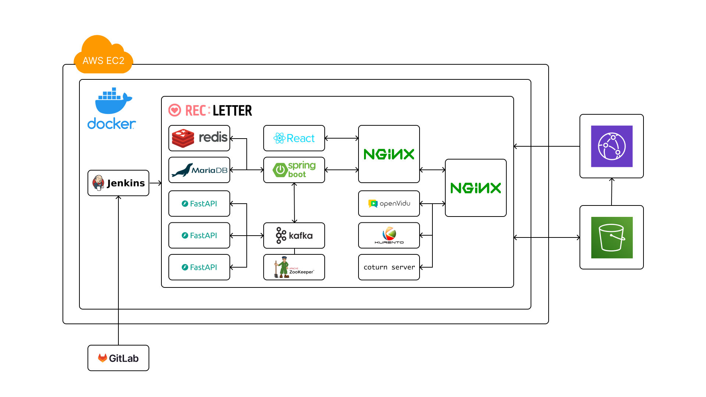

# 7. 팀원 소개

---

-   정은수 : 팀장, 프론트엔드 담당
-   김연수 : 백엔드, 인프라 담당
-   김태운 : 프론트엔드 담당
-   권유경 : 백엔드 담당
-   전하영 : 백엔드 담당
-   이선재 : 백엔드, 디자인 담당
